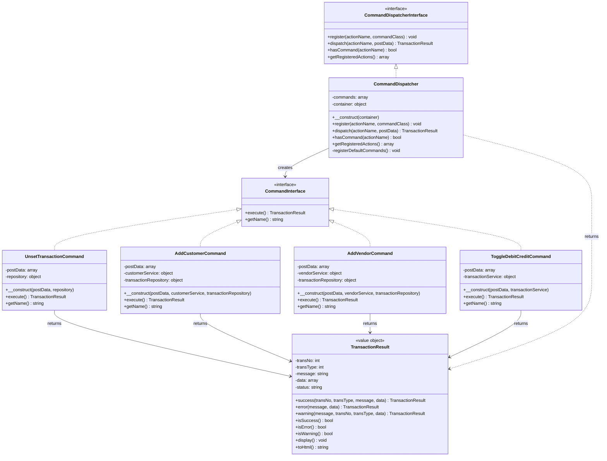
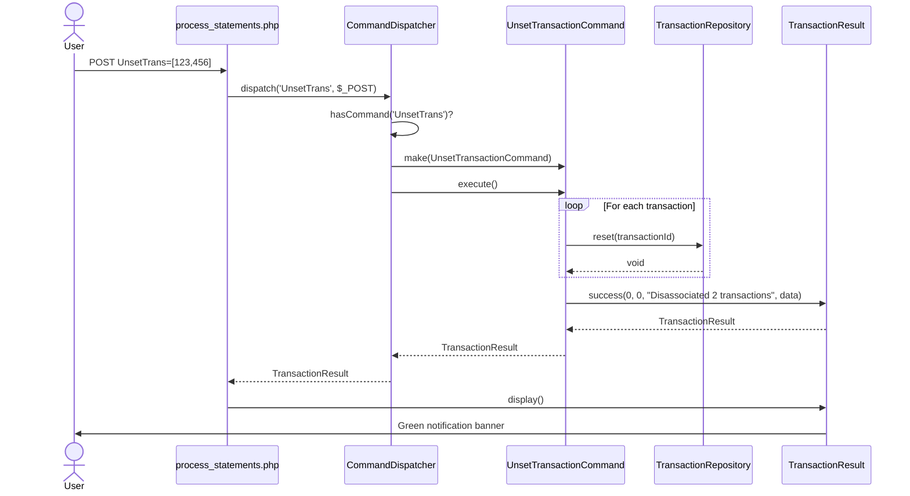
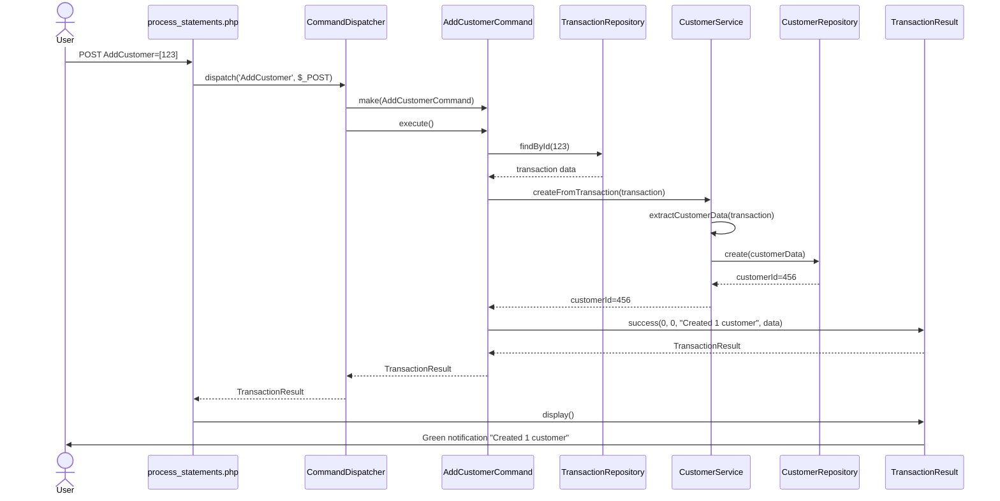
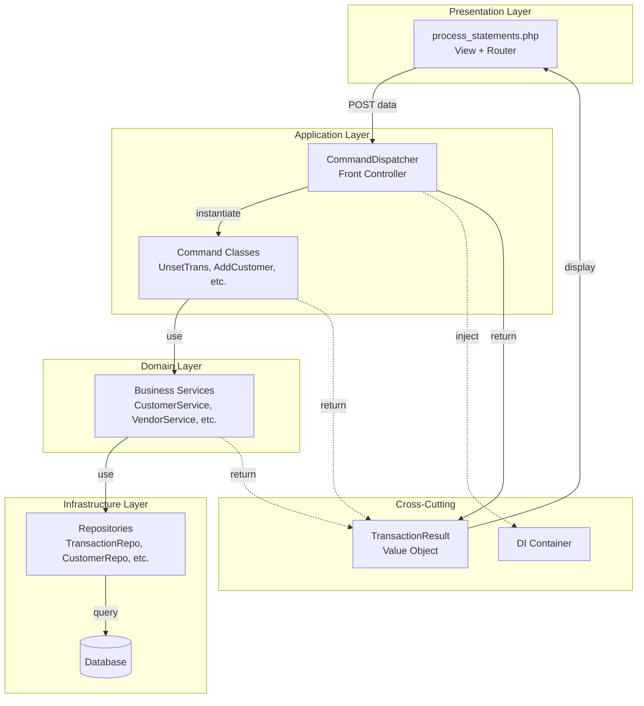
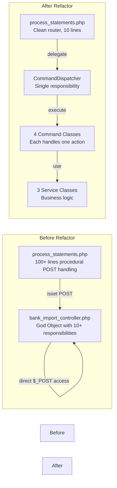
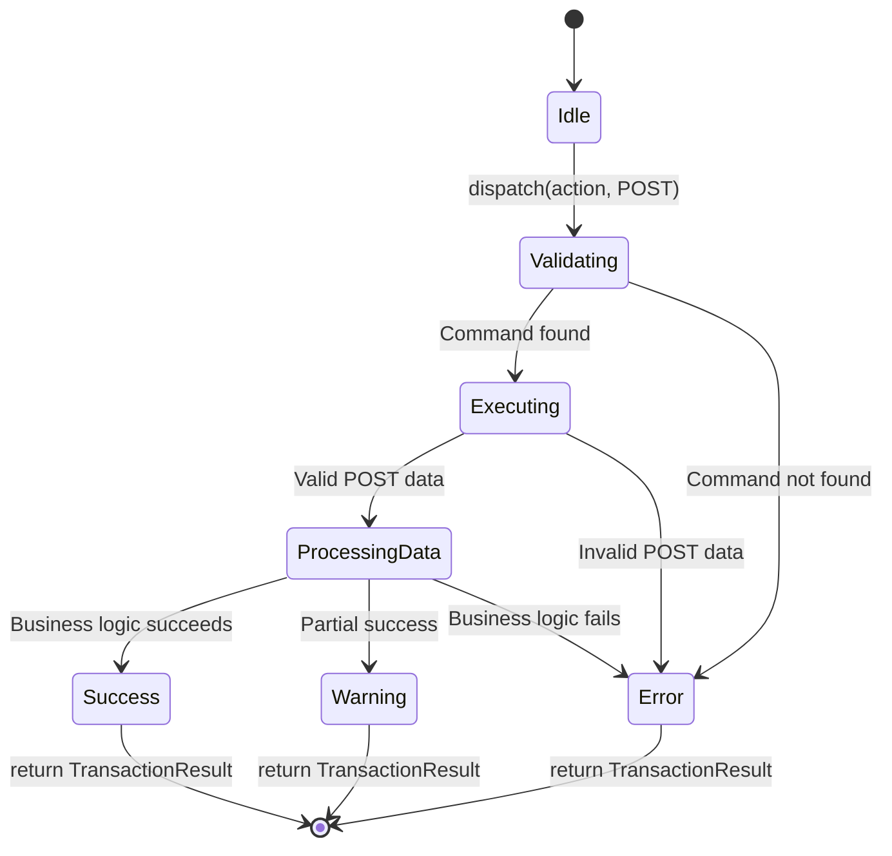
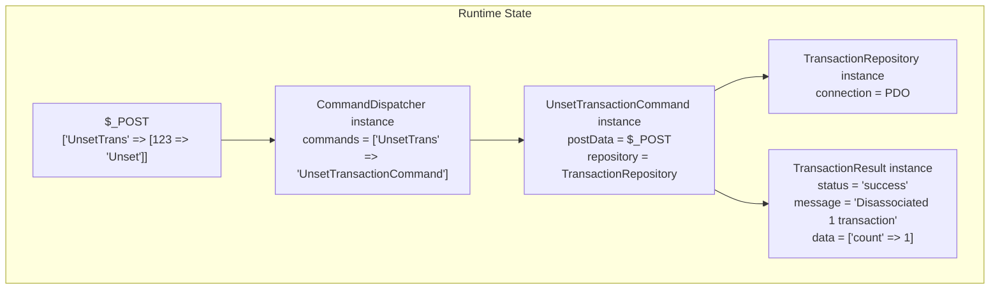

# Command Pattern Architecture - UML Diagrams

## Class Diagram



## Sequence Diagram: UnsetTransaction Flow



## Sequence Diagram: AddCustomer Flow



## Component Diagram



## Deployment Diagram



## State Diagram: Command Execution



## Object Diagram: Runtime Example



## Design Patterns Applied

### 1. Command Pattern
**Problem**: Procedural POST handling scattered across files  
**Solution**: Encapsulate each action as a Command object  
**Benefit**: Testability, extensibility, SRP

### 2. Front Controller Pattern
**Problem**: Multiple entry points for POST actions  
**Solution**: Single CommandDispatcher routes all actions  
**Benefit**: Centralized request handling

### 3. Dependency Injection
**Problem**: Hard-coded dependencies, tight coupling  
**Solution**: Constructor injection of services/repositories  
**Benefit**: Testability, flexibility, SOLID compliance

### 4. Value Object Pattern
**Problem**: Inconsistent result handling  
**Solution**: TransactionResult immutable value object  
**Benefit**: Type safety, consistent API

### 5. Repository Pattern
**Problem**: Direct database access in business logic  
**Solution**: Repositories abstract data access  
**Benefit**: Testability, separation of concerns

---

## SOLID Principles Compliance

### Single Responsibility Principle (SRP) ✅
- **Before**: bank_import_controller handles 10+ different actions
- **After**: Each command class handles exactly ONE action

### Open/Closed Principle (OCP) ✅
- **Before**: Adding new action requires modifying controller
- **After**: Add new command class, register in dispatcher

### Liskov Substitution Principle (LSP) ✅
- All commands implement CommandInterface
- Can be swapped without breaking dispatcher

### Interface Segregation Principle (ISP) ✅
- Separate interfaces for commands, services, repositories
- Clients depend only on methods they use

### Dependency Inversion Principle (DIP) ✅
- Commands depend on interfaces (object), not concrete classes
- High-level modules (commands) don't depend on low-level modules (repositories)

---

## File Organization

```
src/Ksfraser/FaBankImport/
├── Commands/                   # Application layer
│   ├── CommandDispatcher.php   # Front controller
│   ├── UnsetTransactionCommand.php
│   ├── AddCustomerCommand.php
│   ├── AddVendorCommand.php
│   └── ToggleDebitCreditCommand.php
│
├── Contracts/                  # Interface layer
│   ├── CommandInterface.php
│   └── CommandDispatcherInterface.php
│
├── Results/                    # Value objects
│   └── TransactionResult.php   # Already exists
│
└── Services/                   # Domain layer (future)
    ├── CustomerService.php
    ├── VendorService.php
    └── TransactionService.php
```

---

**Status**: Architecture documented  
**Next**: Run tests, verify implementation
