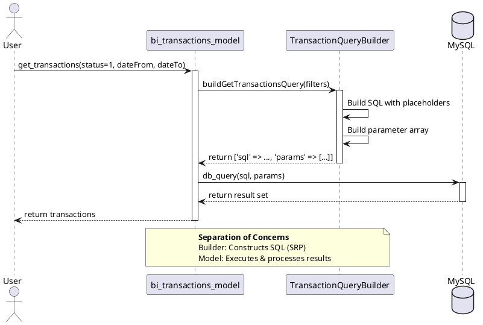
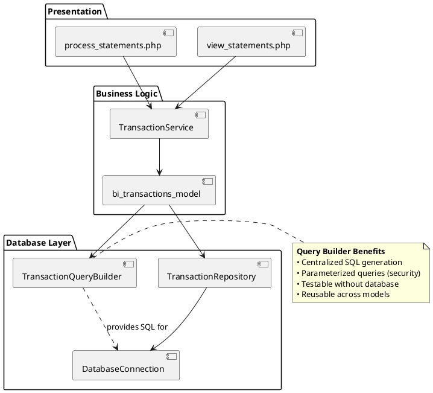

# Transaction Query Builder - UML Diagram

## Class Diagram

```plantuml
@startuml TransactionQueryBuilder

!define LIGHTBLUE
!define LIGHTYELLOW

package "Ksfraser\FaBankImport\Database" {
    
    class TransactionQueryBuilder {
        - string tableName
        - string statementsTable
        
        + __construct(string tableName, string statementsTable)
        + buildGetTransactionsQuery(array filters): array
        + buildGetTransactionQuery(int transactionId): array
        + buildResetTransactionsQuery(array ids, int faTransNo, int faTransType): array
        + buildUpdateTransactionsQuery(array ids, int status, ...): array
        + buildPrevoidQuery(int faTransNo, int faTransType): array
        + buildNormalPairingQuery(?string account): array
        + getTableName(): string
        + getStatementsTableName(): string
        
        --
        **Return Format**
        array {
          'sql' => string,
          'params' => array
        }
    }
    
    note right of TransactionQueryBuilder
        **SOLID Principles**
        • Single Responsibility: Only builds SQL
        • Open/Closed: Extendable via new methods
        • Dependency Inversion: Returns data, not executes
        
        **DRY Principle**
        • Centralizes all SQL generation
        • Prevents duplicate query logic
        • Parameterized queries for safety
    end note
}

package "Usage Example" {
    class bi_transactions_model {
        - TransactionQueryBuilder queryBuilder
        
        + get_transactions(...)
        + get_transaction(int id)
        + update_transactions(...)
        + reset_transactions(...)
        + db_prevoid(...)
    }
    
    bi_transactions_model ..> TransactionQueryBuilder : <<uses>>
    
    note bottom of bi_transactions_model
        Model uses QueryBuilder for SQL generation.
        Separates concerns:
        • QueryBuilder: SQL generation (SRP)
        • Model: Business logic & execution
    end note
}

@enduml
```

## Sequence Diagram - Get Transactions Flow



## Component Diagram



## Responsibility Matrix

| Class | Responsibility | SOLID Principle |
|-------|---------------|-----------------|
| **TransactionQueryBuilder** | Build SQL queries with parameters | SRP - Only query construction |
| **bi_transactions_model** | Business logic & query execution | SRP - Orchestration |
| **TransactionRepository** | Data access & persistence | SRP - Data layer |
| **DatabaseConnection** | Connection management | SRP - Infrastructure |

## Method Signatures

### TransactionQueryBuilder

```php
// Core query building methods
public function buildGetTransactionsQuery(array $filters = []): array
public function buildGetTransactionQuery(int $transactionId): array
public function buildResetTransactionsQuery(array $transactionIds, int $faTransNo, int $faTransType): array
public function buildUpdateTransactionsQuery(
    array $transactionIds,
    int $status,
    int $faTransNo,
    int $faTransType,
    bool $matched = false,
    bool $created = false,
    ?string $partnerType = null,
    string $partnerOption = ''
): array
public function buildPrevoidQuery(int $faTransNo, int $faTransType): array
public function buildNormalPairingQuery(?string $account = null): array

// Return format for all methods:
// [
//     'sql' => 'SELECT ... WHERE ... ?',
//     'params' => [value1, value2, ...]
// ]
```

## Design Patterns Applied

1. **Builder Pattern**: Constructs complex SQL queries step by step
2. **Repository Pattern**: Separates data access from business logic
3. **Dependency Injection**: Models depend on QueryBuilder abstraction
4. **Factory Pattern**: Could add QueryBuilderFactory for different DB types

## Benefits

### Before (Without QueryBuilder)
```php
function get_transactions($status, $dateFrom, $dateTo) {
    $sql = "SELECT t.*, s.account FROM 0_bi_transactions t ...";
    $sql .= " WHERE t.valueTimestamp >= '" . db_escape($dateFrom) . "'";
    // SQL scattered throughout code
    // Hard to test
    // Duplication
}
```

### After (With QueryBuilder)
```php
function get_transactions($status, $dateFrom, $dateTo) {
    $result = $this->queryBuilder->buildGetTransactionsQuery([
        'status' => $status,
        'dateFrom' => $dateFrom,
        'dateTo' => $dateTo
    ]);
    return db_query($result['sql'], $result['params']);
    // Centralized SQL
    // Testable
    // DRY
}
```

## Testing Strategy

```php
// Unit test for QueryBuilder (no database needed!)
public function testBuildGetTransactionsQuery() {
    $builder = new TransactionQueryBuilder('test_table', 'test_statements');
    
    $result = $builder->buildGetTransactionsQuery([
        'status' => 1,
        'dateFrom' => '2025-01-01',
        'dateTo' => '2025-12-31'
    ]);
    
    $this->assertStringContainsString('WHERE', $result['sql']);
    $this->assertCount(3, $result['params']);
    $this->assertEquals('2025-01-01', $result['params'][0]);
}
```

## Future Enhancements

1. **Query Caching**: Cache frequently used queries
2. **Query Optimization**: Add EXPLAIN analysis
3. **Multiple DB Support**: Extend for PostgreSQL, SQLite
4. **Query Profiling**: Add performance monitoring
5. **Dynamic Filters**: More flexible filter combinations

## Version History

| Version | Date | Author | Changes |
|---------|------|--------|---------|
| 20251104.1 | 2025-11-04 | Kevin Fraser | Initial QueryBuilder extraction |
| 20251104.2 | 2025-11-04 | Kevin Fraser | Added parameterized queries |
| 20251104.3 | 2025-11-04 | Kevin Fraser | Added all CRUD operations |

